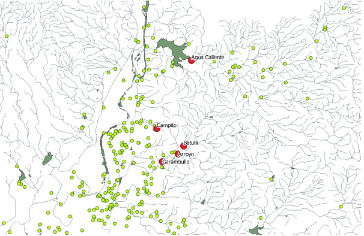
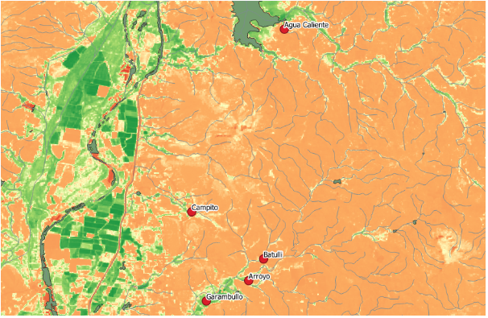
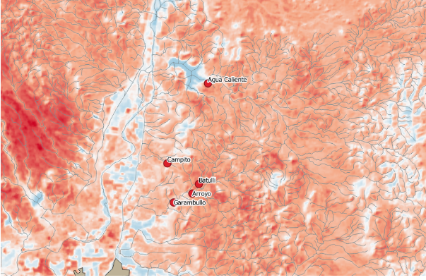

```{r, librerias,include=FALSE}
library(pacman)
library(ggplot2)
library(plotly)
library(gganimate)
library(gifski)
library(mapview)
library(sf)
library(rgdal)
library(maptools)
library(gridExtra)


```

#**¿A qué queremos llegar con la información anterior?**

Como hemos visto, Sonora no es un gran productor de miel; sin embargo, eso no quiere decir que se pueda mejorar, es decir, implementar una estrategia para la colocación de apiarios de forma estrátegica. 
Junto a nuestro maestro, se analizaron las siguientes imágenes.

###**¿Qué tienen en común las zonas geográficas en las cuales están los panales más productivos?**

- Cercanía a cuerpos de agua (río)
- Cercanía a asentamientos humanos
- Temperatura
- Elevación
- Tipo de vegetación 


```{r, include=FALSE, leerMapas}
apiarios <- st_read("Datos/Mapas/Apiarios/APIARIOS.shp")
rios <- st_read("Datos/Mapas/Cuenca/RH09Ba/RH09Ba_hl.shp")
cuerpos_agua <- st_read("Datos/Mapas/Cuenca/RH09Ba/RH09Ba_ha.shp")

```


###**Figura 1**

Los puntos rojos, son los apiarios registrados, además de eso, podemos observar el lúgar dónde se encuentran.
Donde el apiario más productivo es Agua Caliente y el segundo Batulli.


```{r mapa1}

mapview::mapview(apiarios,labels=F, map.types = "Esri.WorldImagery")
```

###**Figura 2**

En este mapa podemos ver:

- Asentamientos humanos (puntos amarillos).
- Cuerpos de agua.

Con esto podemos observar que los apiarios están cerca de cuerpos de agua, pero lejos de asentamientos humanos.
```{r mapa2}
mapview::mapview(list(rios, cuerpos_agua, apiarios))
```



###**Figura 3**

En el siguiente mapa, podemos ver las vegetación del lugar:

- Poca o nula (naranja)
- Mucha o moderada (verde)

Curiosamente podemos darnos cuenta de que a las abejas les gusta un lugar "termino medio" por decirlo de alguna manera, es decir, cerca de vegetación pero no en el lugar exacto. 



###**Figura 4**

Gracias a este mapa térmico podemos decir que a las abejas les gusta estar en un clima no muy caluroso, pero a su vez no tan frío.




#**Conclusiones**

En la actualidad se conoce que de de los más de 20 mil especies que existen, las cuales se clasifican en 9 familias, 6 familias de abejas viven en México.
Cada especie se desarrolla en ambientes distintos,  los cuales tienen características particulares que favorecen su comportamiento y, en este caso la producción de miel. 
Es importante saber esto ya que, de esto depende de los cuidados de cada una.

Se sabe qué, hace unos años las abejas corrían un gran peligro, de las cuales aproximadamente 2000 especies, que habitan en México, se encuentran en peligro de extinción desde el año de 2019. Esto se debe al cambio climático, la agricultura intensiva y las plaguicidas. 

Todos los puntos tocados con anterioridad nos sirven para que podamos ayudar a que estas se desarrollen en un ámbito más agradable para ellas, en donde los seres humanos dejemos que ellas se desarrollen con seguridad o, en caso contrario, contribuyamos en su crecimiento. Ya que, estas cuentan con una función muy importante, la cual es la polinización. Sin esto, el planeta tendría grandes cambios los cuales serían catastróficos

Teniendo esta información a mano, sabemos los puntos clave de estos para aumentar su desarrollo, obteniendo a su vez información para conocer mejor a la especie y poder mejorar su ambiente o, buscar un lugar parecido para su desarrollo.